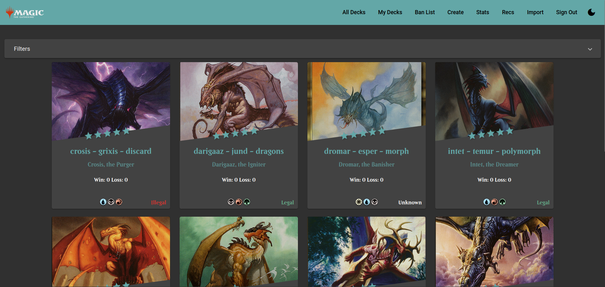
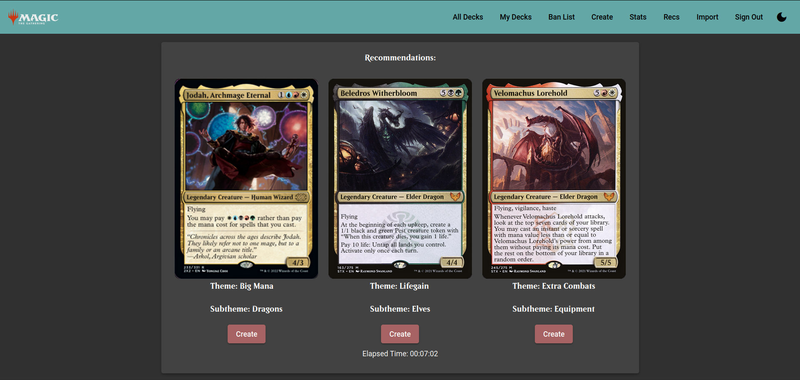

# CommanderDash3

**APP IS STILL VERY MUCH IN DEVELOPMENT. THE BACKEND API ISN'T YET AVAILABLE, SO RIGHT NOW IT IS ONLY GOOD FOR USING THE SOURCE CODE!**

A web dashboard for managing edh deck data, including match history and deck preferences. Working recommendation system to suggest commanders based on preferences.

Capable of managing a table-banlist and determining deck legality using it.

